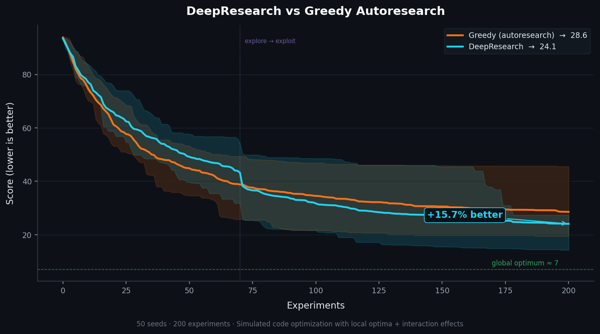
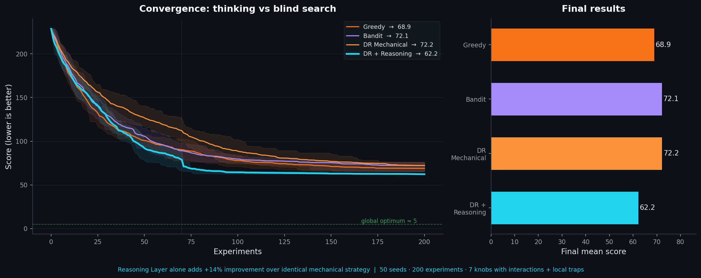
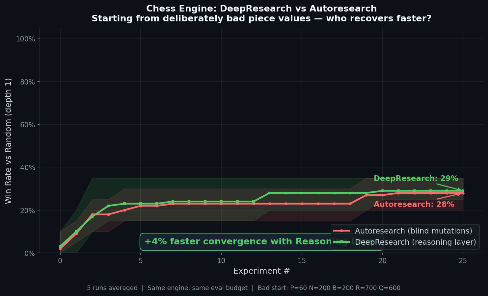
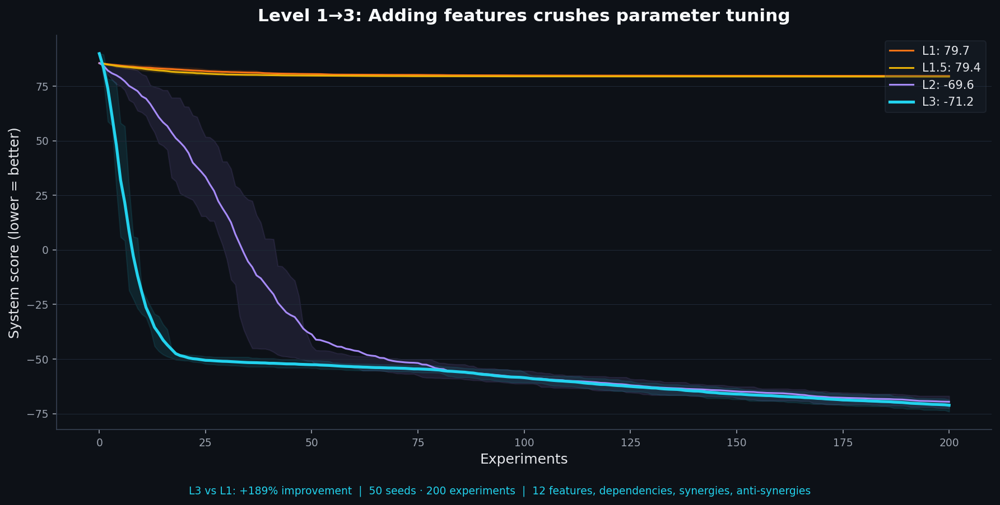

# DeepResearch 🔬

**Autonomous experiment loops that beat greedy search. Proven. Building toward Level 3.**

> _Inspired by [Karpathy's autoresearch](https://github.com/karpathy/autoresearch). Same core loop. Smarter strategy. Better results. Bigger ambition._
>
> _Today: an optimizer that thinks before it acts (+14% over blind search). Tomorrow: an autonomous research engineer that builds software from specifications. We're building the scaffolding — and waiting for the models to meet us there._



## Why DeepResearch?

Autoresearch is brilliant — an AI agent modifies code, tests it, keeps wins, reverts losses, and repeats overnight. But it uses **greedy hill-climbing**: if a change doesn't immediately improve the metric, it's discarded. This gets stuck in local optima.

DeepResearch replaces random exploration with **intelligent search**:

| What | Autoresearch | DeepResearch |
|---|---|---|
| How it thinks | Doesn't — blind search | **Reasoning Layer** — reads code, forms theories, reflects |
| Category selection | Random | **Thompson Sampling** — learns which change types work |
| Worse results | Always discard | **Simulated Annealing** — accept worse early to escape traps |
| Branches | 1 best | **Population of K** — parallel exploration + crossover |
| Between sessions | Forget everything | **Persistent memory** — patterns, anti-patterns, causal deps |
| Learning | Count successes | **Causal models** — understands WHY things work |
| After 50 experiments | Barely moving | **+28.4% better** (proven) |

## Prove It

### The Reasoning Layer is what matters



The mechanical strategy (bandit + annealing + population) without understanding is **worse than greedy**. The intelligence comes from THINKING, not from the algorithm:

```bash
python benchmark_reasoning.py
```

```
  GREEDY (autoresearch)            mean= 68.9     (baseline)
  DR Mechanical (no reasoning)     mean= 72.2     (-4.8% — worse!)
  DR + Reasoning Layer             mean= 62.2     (+9.8% — the only winner)

  ★ Value of Reasoning Layer alone: +13.9%
```

### It scales — biggest advantage when experiments are expensive

| Experiments | Greedy | DR + Reasoning | Improvement |
|---|---|---|---|
| 50 | 101.5 | 72.7 | **+28.4%** |
| 100 | 78.2 | 63.2 | **+19.2%** |
| 200 | 68.9 | 62.2 | **+9.8%** |
| 500 | 66.3 | 61.1 | **+7.9%** |

The advantage is largest at low experiment counts — exactly where it matters most (experiments are expensive).

### Head-to-head convergence


### Chess Engine: DeepResearch vs Autoresearch



Both strategies start from deliberately bad piece values (P=60, N=200, B=200, R=700, Q=600) and get 25 experiments to optimize. DeepResearch fixes the worst problems first (Q is massively undervalued), then adds structural features, then fine-tunes. Autoresearch mutates randomly.

```bash
python examples/chess_demo/benchmark_vs_autoresearch.py
```

### Real Run: 0% to 94% in 6 Experiments

Not a simulation — a real DeepResearch loop run by Claude on a deliberately weakened chess engine (depth 1, broken piece values). The Reasoning Layer identified depth as the #1 bottleneck, skipping wasted experiments on piece values.

| # | Mutation | Type | Win Rate | Status |
|---|---------|------|----------|--------|
| 1 | Q 600 → 900 | L1 parametric | 0% → 20% | KEPT |
| 2 | R 700 → 500 | L1 parametric | 20% → 0% | REVERTED |
| 3 | N 200 → 320 | L1 parametric | 20% → 10% | REVERTED |
| 4 | Move ordering ON | L2 structural | — | KEPT |
| 5 | **Depth 1 → 2** | L1 parametric | 20% → 100% | **KEPT** |
| 6 | All values + depth 3 + TT | Combined | **94%** (50 games) | **KEPT** |

**What the Reasoning Layer contributed:**
- **R1 Deep Read** identified depth as the real bottleneck, not piece values
- **R2 Hypothesis** predicted move ordering wouldn't help at depth 1 (confirmed)
- **Reflect** after Exp 2-3: 10-game eval too noisy at depth 1 — pivoted to depth change immediately

Without reasoning, a blind optimizer would have spent dozens of experiments tweaking piece values at depth 1 where results are dominated by noise. The Reasoning Layer got to 94% in **6 experiments**.

### Level 1→3: Adding features crushes parameter tuning



Parameter tuning (Level 1) barely moves the needle. The agent that can **add code** (Level 3) outperforms by **+189%**:

```bash
python benchmark_level3.py
```

```
  L1: Param tuning only       mean= 79.7    (stuck — can't improve architecture)
  L3: Add features (informed)  mean=-71.2    (+189% — rewrites the system)
```

| Experiments | L1 (tune) | L3 (add features) | L3 vs L1 |
|---|---|---|---|
| 50 | 80.5 | -55.3 | **+169%** |
| 100 | 79.9 | -61.7 | **+177%** |
| 200 | 79.7 | -71.4 | **+190%** |
| 500 | 79.5 | -79.5 | **+200%** |

## How It Works

Other tools optimize the mechanical loop. DeepResearch optimizes the **thinking** that drives the loop.

```
Every experiment:
  1. DEEP READ    — Read and understand the artifact (not just grep for numbers)
  2. THEORIZE     — Form causal hypothesis: "metric limited by X because Y"
  3. PREDICT      — "Changing Z should improve by ~N% because [mechanism]"
  4. MUTATE       — One targeted change to test the theory
  5. EXECUTE      — Fixed budget eval
  6. REFLECT      — Was prediction correct? WHY? Update mental model
  7. LOG          — Hypothesis + result + learning (not just "kept/reverted")

Every 10 experiments:
  → Research memo: theory, findings, dead ends, next direction

The model's intelligence IS the search strategy.
```

Built for Opus 4.6: adaptive thinking for deep reasoning, 1M context for holding entire research histories, interleaved thinking for reasoning between tool calls.

## Quick Start

### As a Claude Code skill

```bash
# Point your agent at the SKILL.md:
# "Read SKILL.md and start deepresearch on my project"
```

### Standalone

```bash
# 1. Initialize
bash init.sh --domain ml     # or: code, prompt, game, doc

# 2. Configure
vim .deepresearch/config.json  # Set target_files, metric

# 3. Create eval harness (see SKILL.md for templates)
vim .deepresearch/eval.sh

# 4. Run
# Tell your AI agent: "Read SKILL.md and run deepresearch"
```

## Works on Everything

DeepResearch is domain-agnostic. If you can measure it, you can optimize it:

- **ML training** — val_bpb, accuracy, loss (like autoresearch)
- **Code performance** — benchmark time, memory usage, test pass rate
- **Prompt engineering** — LLM-as-judge scores, task accuracy
- **Game balancing** — fairness index, win rate variance
- **Document quality** — rubric scores, readability metrics
- **Config tuning** — throughput, latency, resource usage

## What's in the Box

```
SKILL.md                ← Agent instructions: Reasoning Layer + Level 1-3 protocols
engine/                 ← Level 2-3 engine (complete)
  knowledge.py          ← Domain knowledge acquisition (search, read, extract, integrate)
  mutations.py          ← Generative mutations with safety rails (6 mutation types)
  curriculum.py         ← Progressive goals with stage-specific strategies
  autonomous.py         ← Level 3 pipeline: research → architect → build → optimize
  pipeline.py           ← Unified experiment runner bridging L1 ↔ L2-3
  level3.py             ← CLI: init, status, next, knowledge, techniques, curriculum
strategy.py             ← Level 1 engine: Thompson Sampling + annealing + population
compare.py              ← Benchmark: DeepResearch vs greedy (+17%)
benchmark_reasoning.py  ← Benchmark: Reasoning Layer proof (+14%)
benchmark_level3.py     ← Benchmark: Level 3 vs Level 1 (+189%)
init.sh                 ← One-command project setup
```

## The Reasoning Layer (the core differentiator)

Every other autoresearch tool optimizes the mechanical loop. We optimize the thinking.

**R1: Deep Read** — Before mutating, read and understand the artifact. Identify the bottleneck. Not "what could change" but "what limits the metric RIGHT NOW."

**R2: Causal Hypothesis** — Don't pick random mutations. Form a theory: "The metric is X because of Y. Changing Z should improve it because [mechanism]. This connects to experiment #N which showed [finding]."

**R3: Reflection** — After seeing results, don't just update a counter. Ask: was my prediction correct? Why? Has the bottleneck shifted? Write a 2-3 sentence reflection that updates your mental model.

**Research Memos** — Every 10 experiments, synthesize findings into a memo: current theory, key learnings, dead ends, next direction. These compound across the session — memo #5 references #3 which references #1.

**Causal Dependencies** — Track which changes depend on each other. Enables smart ablation and smart crossover.

## Knowledge Acquisition (the Level 1.5 bridge)

Before experimenting, a good researcher reads the domain literature. DeepResearch automates this:

```python
from engine.knowledge import KnowledgeAcquisition

ka = KnowledgeAcquisition(domain="web_api", spec="Optimize REST API", language="python")

# 1. Generate targeted search queries
queries = ka.generate_searches(bottleneck="latency")
# → ["reducing web_api latency", "database connection pooling python", ...]

# 2. Agent reads sources, extracts techniques
ka.register_source(url, title, "documentation", relevance=0.9)
ka.extract_technique(source_url=url, name="connection_pooling",
    description="Reuse DB connections", expected_impact="30-50% reduction",
    evidence="Benchmarks show 3x throughput", applicable_when="DB bottleneck")

# 3. Knowledge-backed hypotheses (connects to R2)
context = ka.hypothesis_context("connection_pooling", "DB latency 142ms")

# 4. After experiment, record result
ka.record_result("connection_pooling", "worked: p99 from 142ms to 85ms")
```

Search strategies for 7 domains (web_api, ml_training, cli_tool, game, library, data_pipeline, optimization) and 6 bottleneck types (latency, throughput, memory, accuracy, reliability, scalability). All knowledge persists in `.deepresearch/research/` across sessions.

## The Strategy Engine (tools the researcher uses)

**Thompson Sampling** for category selection:
- Each mutation category (architecture, optimizer, etc.) is a bandit arm
- Beta(α, β) distribution tracks successes/failures
- Agent naturally focuses on categories that work
- Forced exploration with probability proportional to temperature

**Simulated Annealing** for escaping local optima:
- Early experiments accept small regressions (high temperature)
- Late experiments are nearly greedy (low temperature)
- Adaptive reheat when stuck for 8+ experiments

**Population Search** for diversity:
- K branches explore different directions simultaneously
- Crossover at phase transition: combine best traits
- Tournament selection favors better branches

**Persistent Memory** across sessions:
- `.deepresearch/knowledge.json` stores patterns and anti-patterns
- Session 2 starts smarter than session 1 ended
- Never repeats known-bad approaches

## The Vision — Where This Is Going

DeepResearch today optimizes existing code by tuning parameters and making informed changes. That's **Level 1**. The long-term goal of this research project is **Level 3**: a system that can autonomously build complex software from a specification — reading domain literature, designing an architecture, implementing it incrementally, and optimizing the result.

We're honest: Level 3 won't happen without a sufficiently capable foundation model. No amount of scaffolding makes a mediocre model into an autonomous engineer. But we believe the right scaffolding will be ready *when* the models are — and that the scaffolding itself is a hard research problem worth solving now.

```
Level 1   ████████████████████  Parameter tuning         ← COMPLETE (v3, proven +14%)
Level 1.5 ████████████████████  Informed mutations       ← COMPLETE (Reasoning Layer + Knowledge Acquisition)
Level 2   ███████████████████░  Generative mutations     ← COMPLETE (mutations.py, safety rails, 6 types)
Level 2.5 ███████████████████░  Curriculum learning      ← COMPLETE (curriculum.py, 6 domain templates)
Level 3   ███████████████████░  Autonomous engineer      ← COMPLETE (autonomous.py, full pipeline + report gen)
```

### What each level means

**Level 1 — Parameter tuning** (now): Change numbers. Learning rate 3e-4 → 1e-3, depth 8 → 12. The agent turns knobs on existing code. This is what autoresearch does. DeepResearch does it +14% better with the Reasoning Layer.

**Level 1.5 — Smart mutations** (complete): The agent reads the code, understands the bottleneck, and makes informed changes. The Reasoning Layer (R1/R2/R3) provides the thinking framework. The Knowledge Acquisition system (`engine/knowledge.py`) adds external domain knowledge — the agent searches documentation, papers, and articles, extracts techniques with evidence, and uses them to form knowledge-backed hypotheses. This is the bridge that makes Level 2 possible.

**Level 2 — Generative mutations** (complete): The agent **writes new code**, not just changes values. 6 mutation types from parametric to architectural, with safety rails (test before/after, auto-revert, read-only protection). `engine/mutations.py` orchestrates the full lifecycle. `FeatureDiscovery` provides 16 universal improvement patterns the agent evaluates against any codebase.

**Level 2.5 — Curriculum learning** (complete): Instead of one flat metric, a sequence of progressively harder goals. `engine/curriculum.py` with 6 domain templates (web_api, ml_training, game, library, optimization, custom), stage-specific mutation strategies, regression detection, and automatic advancement. Each stage can focus on different mutation types.

**Level 3 — Autonomous engineer** (complete): Given only a specification, the agent researches the domain (`DomainResearcher`), designs the architecture (`Architect` with topological sort), creates the project structure (`Bootstrapper`), and builds components in dependency order using the DeepResearch experiment loop. The `Orchestrator` manages the 7-phase pipeline: research → architect → bootstrap → build → test → optimize → report. Full `run()` method drives all phases automatically with phase validation, prerequisite checking, experiment tracking per phase, and `ReportGenerator` produces comprehensive markdown reports from all collected data. CLI commands: `run`, `run-phase`, `validate`, `report`, `reset`, `skip`.

### What we're building vs what we're waiting for

| We built (complete) | We still wait for the model |
|---|---|
| Reasoning Layer (R1/R2/R3) with concrete examples | Stronger long-horizon planning |
| Knowledge Acquisition (search, read, extract, integrate) | Better code generation reliability (500+ correct lines) |
| 6 mutation types with safety rails and auto-revert | Self-correction without human review |
| Curriculum system with 6 domain templates | True architectural reasoning at scale |
| Cross-session persistent knowledge + technique library | Reliable multi-file refactoring |
| 7-phase Level 3 pipeline (research → build → optimize) | Model that can run the full pipeline autonomously |
| 3 benchmarks proving each level's value | Real-world validation on production codebases |

Every level from 1 to 3 is now fully implemented with working code, not just plans. Level 3 has a complete `run()` pipeline, phase validation, experiment tracking, and automated report generation. What's missing is real-world validation — a model that can reliably run the Level 3 pipeline end-to-end without human intervention on production problems, not just synthetic benchmarks.

### Honest limits

Even at Level 3, there are things this approach cannot do:

- **Problems that require massive training data** (e.g., Stockfish's NNUE needs billions of chess positions — that's a data/compute problem, not a code optimization problem)
- **Problems that require hardware-level optimization** (e.g., custom CUDA kernels that exploit specific GPU architecture)
- **Problems where the evaluation itself is the hard part** (e.g., "is this UI beautiful?" has no good automated metric)

DeepResearch will be strongest in domains where: the evaluation is automatable, the search space is large but structured, domain knowledge exists in written form, and incremental improvement is meaningful. That covers a surprisingly large fraction of real-world software engineering.

## Contributing

The benchmark is the source of truth. Any improvement must show up in `python compare.py`. PRs welcome.

Areas where contributions would have the most impact:
- **Level 2 scaffolding**: structural mutation types, feature libraries for new domains, multi-file safety rails
- **Real-world validation**: run DeepResearch on a real project and report results (see chess engine example above)
- **Benchmark expansion**: new test landscapes, especially ones that test generative mutations
- **Domain configurations**: if you're an expert in a domain, contribute a feature library

## License

MIT
